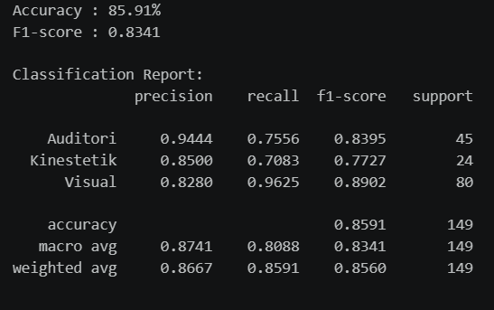
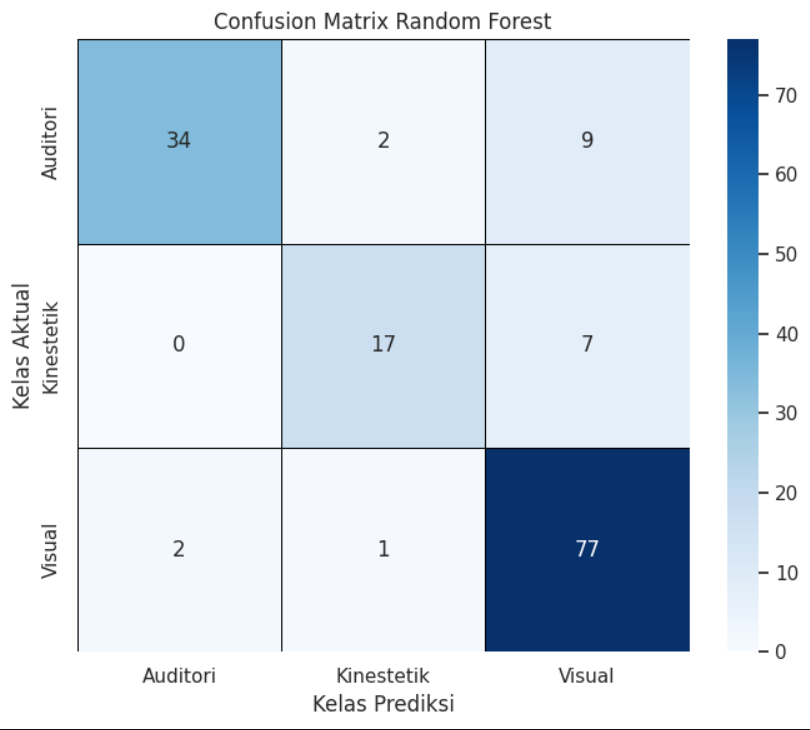
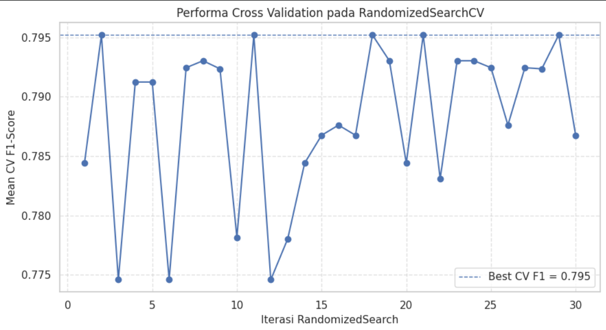
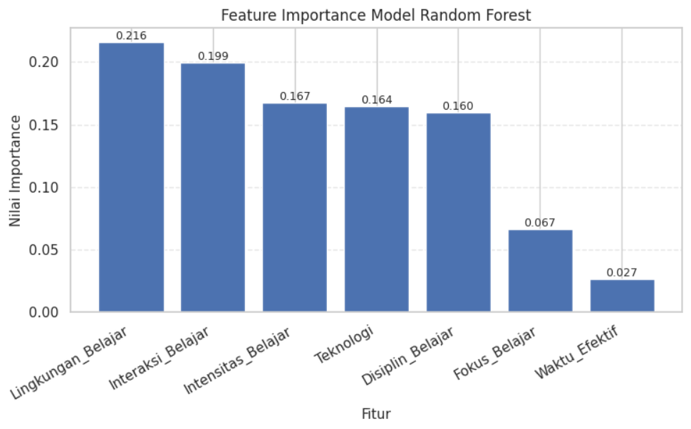

## Results

### Model Performance

* Accuracy: **85.91%**
* Macro F1-Score: **0.8341**
* Weighted F1-Score: **0.8560**

### Classification Report

### Confusion Matrix

### Cross Validation Performance

Best Cross Validation F1 Score: **0.795**

### Feature Importance

The most influential features for predicting learning styles are:

1. Lingkungan_Belajar (0.216)
2. Interaksi_Belajar (0.199)
3. Intensitas_Belajar (0.167)
4. Teknologi (0.164)

